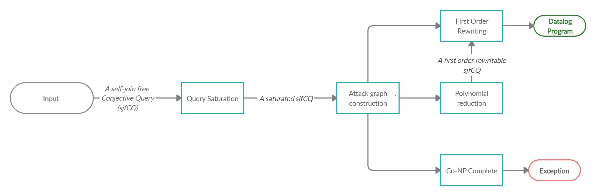

# __cqapk_to_datalog__
__cqapk_to_datalog__ (Consistent Query Answering under Primary Key constraints to Datalog) is a Python 3.x library aiming to provide a tool capable of encoding the problem of computing consistent answers into a Datalog program.

# Execution Flow
The self-join free conjective query given as input is saturated if necessary. Then, according to the corresponding attack graph, either an exception is raised if CERTAINTY for the input query is not expressible in Datalog, or a Datalog program equivalent to CERTAINTY for the given input is created. This last case may need to reduce the problem to one rewritable in first-order logic.

The output Datalog program and a database can then be given as input to a Datalog engine (we've been using DLV). This step may be included inside __cqapk_to_datalog__ in future versions.


# Input Format
![f1]
## Manually create input 
```python
from cqapk_to_datalog import rewrite
from cqapk_to_datalog.data_structures import AtomValue,Atom,ConjunctiveQuery,FunctionalDependency
# Initialize variables
x = AtomValue("X", True)
y = AtomValue("Y", True)
z = AtomValue("Z", True)
# Initialize atoms
atom_r = Atom("R", [x, y])
atom_s = Atom("S", [y, z])
# Initialize functional dependencies
fd1 = FunctionalDependency(frozenset([x]), y)
fd2 = FunctionalDependency(frozenset([y]), z)
# Initialize the conjunctive query
q = ConjunctiveQuery({}, [])
q = q.release_variable(x)
q = q.add_atom(atom_r, frozenset([fd1]), [True, False], False)
q = q.add_atom(atom_s, frozenset([fd2]), [True, False], False)
datalog_program = rewrite.rewrite(q)
print(datalog_program)
```
## Read a JSON file
*See sample_files/CQ/json_schema.json*
```json
{
  "values" : ["X", "Y", "Z"],
  "free_vars" : [],
  "atoms": [
    {
      "name" : "R",
      "consistent" : false,
      "content" : [0, 1],
      "key" : [true, false],
      "fd" : [
        {
          "left" : [0],
          "right" : 1
        }
      ]
    },
    {
      "name" : "S",
      "consistent" : false,
      "content" : [1, 2],
      "key" : [true, false],
      "fd" : [
        {
          "left" : [1],
          "right" : 2
        }
      ]
    }
  ]
}
```
```python
from cqapk_to_datalog.file_handle import read_cq_file
from cqapk_to_datalog import rewrite

q = read_cq_file("../sample_files/CQ/sample_1.json", "../sample_files/CQ/json_schema.json")[0]
datalog_program = rewrite.rewrite(q)
print(datalog_program)

```
# Dependencies
- NetworkX 
    - *pip3 install networkx*
    
    
[f1]: http://chart.apis.google.com/chart?cht=tx&chl=q=R(\underline{x},y),S(\underline{y},z)
